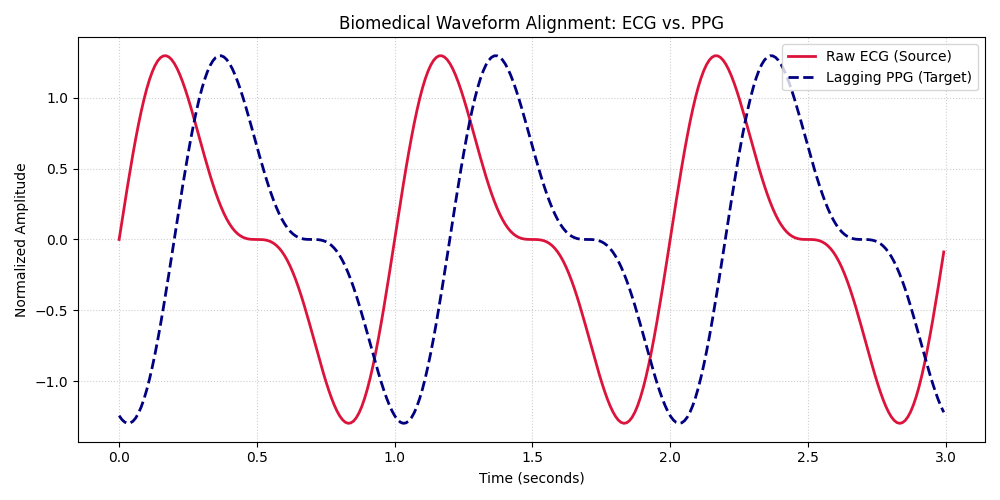

# Signal Processing: ECG & PPG Cross-Correlation Pipeline

This repository hosts a production suite of 10 core Python scripts developed during my IIT Research Internship, focusing on digital signal processing algorithms for biomedical waveforms.

## 🔬 Project Overview
The core objective of this project is to analyze the phase shift, temporal latency, and statistical alignment between **Electrocardiogram (ECG)** and **Photoplethysmogram (PPG)** biological signals. 

Understanding this relationship is crucial for tracking Pulse Transit Time (PTT) and non-invasive blood pressure monitoring.

## 🧮 Mathematical Pipeline
The architecture utilizes algorithmic cross-correlation to measure waveform similarity as a function of the displacement of one relative to the other:

* **Signal Conditioning:** Normalization and filtration of raw sensor noise.
* **Cross-Correlation Matrix:** Computing discrete sliding vector dot products to isolate the peak delay time ($t_{delay}$).
### Waveform Synchronization Visual
Below is the distribution graph automatically generated by the signal conditioning script showing phase delay ($t_{delay}$):

## 📁 Repository Structure
The codebase is modularized into 10 distinct operational scripts:
* `01_load_signal.py` to `03_filter_noise.py`: Ingestion, fast-Fourier denoising, and baseline correction.
* `04_cross_corr.py` to `07_peak_detection.py`: Mathematical shifting and localized maxima calculations.
* `08_metrics.py` to `10_export_results.py`: Generating phase logs and exporting data matrices.

## 🛠️ Requirements
* Python 3.x
* NumPy & SciPy (Signal Processing toolkits)